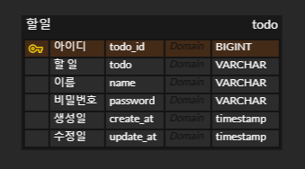
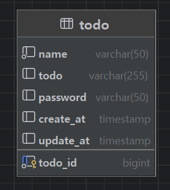
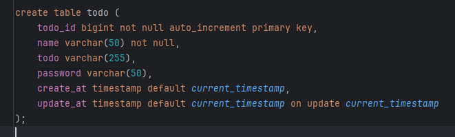

# 일정 관리 앱

Spring Boot, SQL, JAVA

## 기능

### Lv 0. API 명세 및 ERD 작성

1. **API 명세서 작성하기**

|   기능   | Method |         URL         | Path Variable | Request Parameter | Request Body                                                            |                                                                  Response                                                                  |
|:------:|:------:|:------------------:|:-------------:|:-----------------:|:------------------------------------------------------------------------|:------------------------------------------------------------------------------------------------------------------------------------------:|
| **할 일 생성** |  `POST`  | `/todos` | - | - | { <br/>"name": "이름", <br/>"todo": "할 일", <br/>"password": "비밀번호" <br/>} |   { <br/>"todoId": 1, <br/>"name": "이름", <br/>"todo": "할 일", <br/>"password": "비밀번호", <br/>"createAt": "2024-03-26 12:00:00", <br/>"updateAt": "2024-03-26 12:00:00" <br/>}   |
| **할 일 전체 조회** |  `GET`  | `/todos` | - | - | -                                                                       | [ { <br/>"todoId": 1, <br/>"name": "이름", <br/>"todo": "할 일", <br/>"password": "비밀번호", <br/>"createAt": "2024-03-26 12:00:00", <br/>"updateAt": "2024-03-26 12:00:00" <br/>} ] |
| **할 일 단일 조회** |  `GET`  | `/todos/{id}` | ✅ | - | -                                                                       |   { <br/>"todoId": 1, <br/>"name": "이름", <br/>"todo": "할 일", <br/>"password": "비밀번호", <br/>"createAt": "2024-03-26 12:00:00", <br/>"updateAt": "2024-03-26 12:00:00" <br/>}   |
| **할 일 수정** |  `PUT`  | `/todos/{id}` | ✅ | - | { <br/>"name": "이름", <br/>"todo": "할 일", <br/>"password": "비밀번호" <br/>}                     |   { <br/>"todoId": 1, <br/>"name": "이름", <br/>"todo": "할 일", <br/>"password": "비밀번호", <br/>"createAt": "2024-03-26 12:00:00", <br/>"updateAt": "2024-03-26 12:00:00" <br/>}   |
| **할 일 삭제** | `DELETE` | `/todos/{id}` | ✅ | - | { <br/>"password": "비밀번호" <br/>}                                                  |                                                           `{}` (204 No Content)                                                            |
  

2. **ERD 작성하기**

  


3. **SQL 작성하기**



### Lv 1. 일정 생성 및 조회

1. **일정 생성**
   - 할일, 이름, 비밀번호, 작성일, 수정일 포함
   - 고유 식별자(id)를 자동으로 생성하여 관리
   - 최초 입력 시 작성일 == 수정일

2. **전체 일정 조회**
   - 수정 일 기준 내림차순 정렬

3. **선택 일정 조회**
   - 고유 식별자를 사용하여 조회

### Lv 2. 일정 수정 및 삭제

1. **선택한 일정 수정**
   - 할 일, 이름 수정
   - 비밀번호를 함께 전달
   - 비밀번호가 일치 할 때만 수정
   - 수정 일을 수정한 시점으로 시간 변경

2. **선택한 일정 삭제**
   - 일정 삭제
   - 비밀번호 함께 전달
   - 비밀번호가 일치 할 때만 삭제

- 구조

```text
/schedule
    ├── entity
    │       └── Todo
    ├── dto
    │     ├── TodoRequestDto
    │     └── TodoResponseDto
    ├── controller
    │           └── TodoController
    ├── repository
    │           ├── TodoRepository
    │           └── JdbcTemplateTodoRepository
    └── service
            ├── TodoService
            └── TodoServiceImpl
```